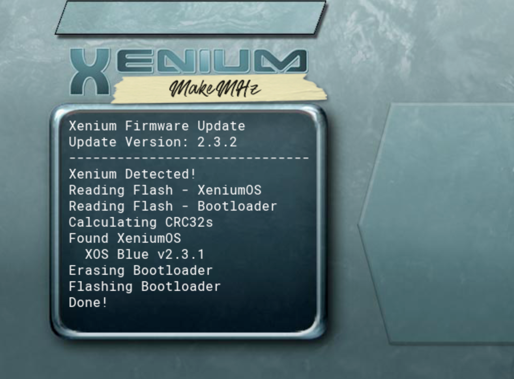

<h1 align="center">
   
  
   
</h1>
<h4 align="center">Firmware update for XeniumOS used on Xenium and OpenXenium modchips to provide software fixes and various improvements.</h4>

 
 
 
 

  <a href="#about">About</a> •
  <a href="#features">Features</a> •
  <a href="#installation">Installation</a> •
  <a href="#licensing">Licensing</a>

## About

Released in early 2004, XeniumOS is the installed operating system on the Xenium series of modchips for the original Xbox. This OS provides users an interface for performing various actions such as flashing various BIOS images.

The xenium-fw-update project aims to fix long-standing issues since its release. Unfortunately, the source code for the XOS has never been released and this project is fully based on reverse-engineered binaries.

## Features
  * Fixes video output 1.6 revision systems when using component video.
  * Removes self-destruct logic. XOS performs device ID checks during boot, and if fails erases itself. In rare cases, this can happen on valid hardware.

## Installation
Download the latest release, copy xenium-os-update.xbe to your Xbox, and launch.

Note: Ensure that your Xenium Chip runs Firmware Version 2.3.1 before using the updater.

## Troubleshooting

- Question: Updater shows error message: Unknown XeniumOS version detected
- Answer: Update your Xenium Modchip with official Firmware 2.3.1, then run this tool again.

## Licensing
xenium-fw-update is free and open source. Please respect the licenses available in their respective folders.
